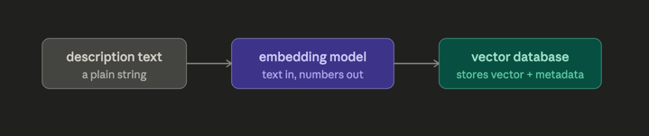

###  We start with MS CS

# Scrapping documents, parsing, and storing them

- VectorDB does not consume the file directly, and we need to extract the information from the files
- It needs text

Raw HTML and parsing
1. Fetch the relevant raw HTMLs
2. Parse these HTMLs into relevant JSON
3. Now check if these are enough for our task

Putting data in SQL and vector DB

SQL - postgres
- We put the data that we need to have exact match with 
- Course code, title, points, level
  Prerequisite groups/options (course codes only)
  Pathway names, requirement groups, option codes
  Breadth group categories and course/wildcard entries
  Program-level numbers (30 points, 2.7 GPA, 6-point 6000-level minimum, etc.)

VectorDB
- When we want to get similar texts
- Probabilistic
- Top K

